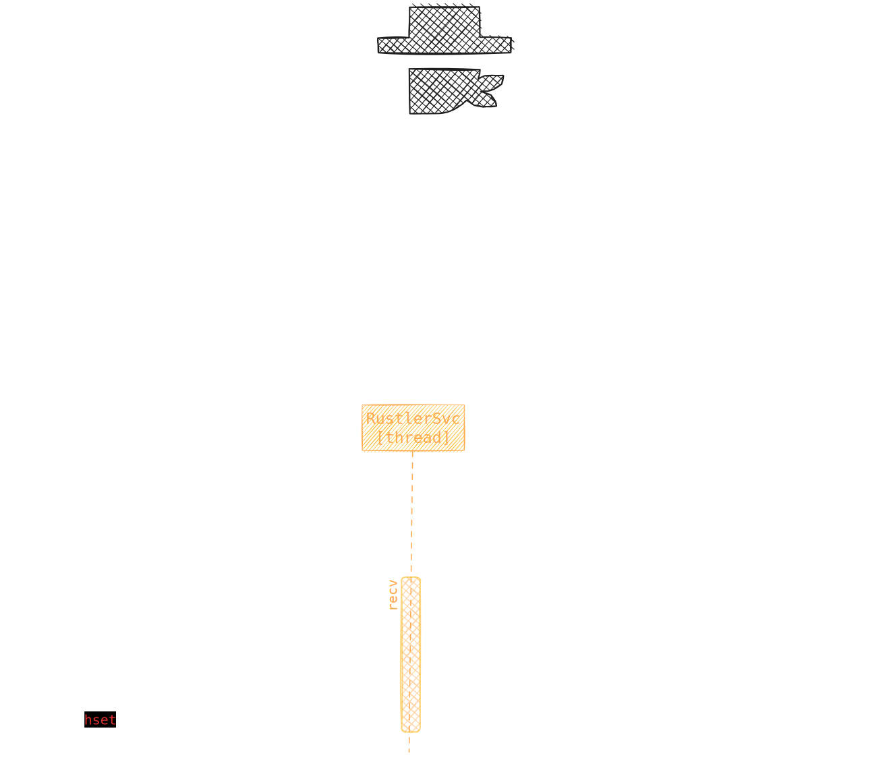

 
 
 

𝐫𝐮𝐬𝐭𝐥𝐞𝐫 ⫮ 𝐜𝐨𝐫𝐞 is a library that contains the core functionality for `rustler`, a web scraping service that scrapes several stock market providers for stock pricing data. It is built using the <code>Rust</code> programming language.

 
 
 

## Why "rustler"

A `rustler` is a person who steals live**_stock_**. Well, this library is a service that collects _stock_ market data from the internet. So, it's a "_rustler_" for stock market data.

Also, this library is built using the `Rust` programming language... so, **_rust_**ler 😊

## What this library includes

This library defines the core functionality for a `rustler`. It includes the following:

-   A [`Rustler`](./lib/rustlers/rustler.rs) trait that defines the core functionality for a `rustler`.
-   A [`RustlersSvc`](./lib/rustlers/svc.rs) which orchestrates the `rustlers` at runtime, scheduling them to scrape stock pricing data between market hours.

More info [here](./lib/rustlers/README.md).

Apart from the above, this library also defines:

-   a [database schema](./lib/entities/orm/) for storing market hours, which is used by the `RustlersSvc` to schedule the `rustlers`.
-   initial [database migrations](./lib/entities/migration) to create the schema.
-   a [grpc server](./lib/grpc/) to interact with the rustlers database.
-    a [websocket gateway server](./lib/socket/) to stream stock pricing data to subscribed clients

> [!NOTE]
>
> This library defines a _rustler_ as a service that scrapes stock pricing data for a
> particular market.
>
> Although this library contains the core and abstract functionality for the rustlers, it doesn't include any concrete implementation for them.
>
> Actual concrete implementations for each market cannot be published for many reasons.

## Diagram

The following diagram shows the core components of the `rustler-core` library and how they interact
with each other.

## Example

Check the [examples](./examples) directory for an example of how to use this library.
